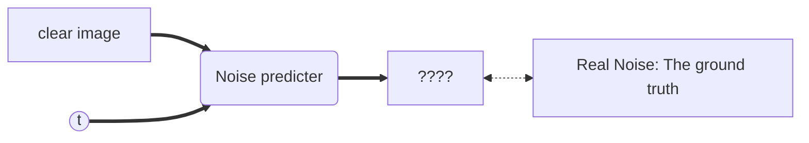

李宏毅 Diffusion Model

Forward process: Add noise
Reverse process: Denoise

VAE(Variation Auto Encoder) image→(Encoder)→latent presentation→(Decoder)→image

Diffusion: Image→(Add noise * N) → Noise → Denoise * N → Image

### Training
- Algorithm:
	- $\mathbf{repeat}$
	- $x_0\sim q(x_0)$ $-\text{sample clean image}$
	- $t\sim  Uniform(\{1,...,T\})$
	- $\epsilon \sim \mathcal{N}(\mathbf{0},\mathbf{I})$ $-\text{sample a noise}$
	- $\text{Take gradient descent step on}$
		-$\nabla_\theta||\epsilon-\epsilon_\theta(\sqrt{\bar{\alpha_t}}x_0+\sqrt{1-\bar{\alpha_t}}\epsilon, t)||^2$ $-\epsilon_\theta\text{ is a noise predictor}$ $-\bar{\alpha_1}>\bar{\alpha_2}>...>\bar{\alpha_T}$   
	- $\mathbf{until}\ converged$

*Use gradient descent to find the hyper parameter $\theta$ by picking different weight sum of $x_0$ and $\epsilon$ , where $\epsilon$ is the gaussian noise, and the weight is an array of $\alpha$ corresponding to different t in a decreasing pattern*

### Sampling
- Algorithm
	- $x_T\sim\mathcal{N}(\mathbf{0},\mathbf{I})$
	- $\mathbf{for}\ t=T,...,1\ \mathbf{do}$
		-$\mathbf{z}\sim\mathcal{N}(\mathbf{0}, \mathbf{I})\ \text{if t > 1, else }\mathbf{z}=0$
		-$x_{t-1}=\frac{1}{\sqrt{\alpha_t}}(x_t-\frac{1-\alpha_t}{\sqrt{1-\bar{\alpha_t}}}\epsilon_\theta(x_t,t))+\sigma_t\mathbf{z}$
	- $\mathbf{end\ for}$
	- $\mathbf{return}\ x_0$

*Start from pure noise, calculate 
$$x_{t-1}=\frac{1}{\sqrt{\alpha_t}}(x_t-\frac{1-\alpha_t}{\sqrt{1-\bar{\alpha_t}}}\epsilon_\theta(x_t,t))+\sigma_t\mathbf{z}$$ recursively with $\alpha_t$ , $\bar{\alpha_t}$ and trained $\epsilon_\theta$, and then finally return $x_0$*

### Maximum Likelihood Estimation
$G\ is\ the\ network$
$$G(z)=x;$$
$$\ z:\text{input: sample a noise vector from Gaussian distribution P}$$
$$x: \text{output: the corresponding produced vector from the sampled }z$$
Sample ${\{x^1, x^2,...x^m\}}$ from $P_{data}:\text{The distribution of real image}$ 
If we can compute $P_{\theta}(x^i):\text{The distribution of produced image, always complicated}$, then we can find the optimal hyper parameter $\theta^*$ with Maximum Likelihood Estimation:
$$\begin{aligned}
\theta^*&=arg\max_\theta\prod_{i=1}^{m}P_\theta(x^i)
=arg\max_\theta log\prod_{i=1}^{m}P_\theta(x^i)\\
&=arg\max_\theta\sum_{i=1}^{m}logP_\theta(x^i)\approx arg\max_\theta E_{x\sim P_{data}}[logP_\theta(x)]\\
&=arg\max_\theta{\int\limits_{x}P_{data}(x)logP_\theta(x)dx}-{\int\limits_{x}P_{data}(x)logP_{data}(x)dx:NOT \ related\ to\ \theta}\\
&=arg\max_\theta\int\limits_xP_{data}(x)log\frac{P_\theta(x)}{P_{data}(x)}dx\\
&=arg\min_\theta\textcolor{cyan}{KL(P_{data}(x)||P_\theta)}
\end{aligned}$$
[[KL Divergence]] for reference
Therfore, Maximum likelihood = Minimize KL Divergence
### VAE: Compute $P_\theta(x)$: Marginalization
$$P_\theta(x)=\int\limits_zP(z)P_\theta(x|z)dz:P \text{ is the simple distribution of z}$$
How to define $P_\theta(x|z)$ ?
As a ==mean== of Gaussian Distribution:
$$P_\theta(x|z)\propto exp(-||G(z)-x||_2)$$
where $||G(z)-x||_2=\sqrt{\sum\limits_{i}(G(z)_i-x_i)^2}$ 
### VAE: Lower Bound of $logP(x)$: Variational Inference
$$
\begin{aligned}
logP_\theta(x)&=logP_\theta(x)\underset{=1,\ q(z|x)\ any}{\underline{\int\limits_zq(z|x)dz}}=\int\limits_zq(z|x)logP_\theta(x)dz\\
&=\int\limits_{z}q(z|x)log\frac{P_\theta(z,x)}{P_\theta(z|x)}dz=\int\limits_zq(z|x)log\frac{P_\theta(z,x)}{\textcolor{pink}{q(z|x)}}\frac{\textcolor{pink}{q(z|x)}}{P_\theta(z|x)}\\
&=\int\limits_zq(z|x)log\frac{P_\theta(z,x)}{q(z|x)}+\underset{\textcolor{cyan}{KL(q(z|x)||P_\theta(z|x))\geq0\ !}}{\underline{\int\limits_zq(z|x)log\frac{q(z|x)}{P_\theta(z|x)}}}\\
&\geq\int\limits_zq(z|x)log\frac{P_\theta(z,x)}{q(z|x)}=E_{q(z|x)}[log\frac{P_\theta(z,x)}{q(z|x)}]
\end{aligned}
$$
$$q(z|x)\text{ is the Encoder in VAE method: }image\rightarrow latent\ presentation$$
Therefore, maximize $logP_\theta(x)$ by maximizing its lower bound: $E_{q(z|x)}[log\frac{P_\theta(z,x)}{q(z|x)}]$

### DDPM: Compute $P_\theta(x)$
Forward: Diffusion process$$x_0\rightarrow x_1\rightarrow ...\rightarrow x_T$$
Denoise:$$x_T \rightarrow ......\rightarrow x_t\rightarrow Denoise\rightarrow G(x_t)\overset{?}{\sim} x_{t-1}\rightarrow......\rightarrow x_0$$
$$P_\theta(x_{t-1}|x_t)=\int\limits_{x_1:x_T}P(x_T)P_\theta(x_{T-1}
|x_T)...P_\theta(x_{t-1}|x_t)...P_\theta(x_0|x_1)dx_1:x_T$$
### DDPM: Maximize $logP_\theta(x_0)$
Equivalent to maximize:$$E_{q(x_1:x_T|x_0)}[log\frac{P_\theta(x_0:x_T)}{q(x_1:x_T|x_0)}]$$
The above one is very similar to the case of VAE, just some variable change.
where:$$q(x_1:x_T|x_0)=q(x_1|x_0)q(x_2|x_1)...q(x_T|x_{T-1})$$
*The above equation is derived from the chain rule of proabability (can simply derived from the defnition of conditional probability), and the property of Markov chain: $x_t\ only\ depends\ on\ x_{t-1}$*

Notice we can represent the forward process as followings:
$$x_t=\sqrt{1-\beta_t}\cdot x_{t-1}+\sqrt{\beta_t}\cdot N_t$$
 $$t=1,2,\dots,T,\ and\ N_1,N_2,\dots,N_T\sim i.i.d.\ \mathcal{N}(\mathbf{0},I)$$
 
$$\begin{aligned}
x_1&=\sqrt{1-\beta_1}x_0+\sqrt{\beta_1}N_1\\
x_2&=\sqrt{1-\beta_2}x_1+\sqrt{\beta_2}N_2\\
&=\sqrt{1-\beta_2}(\sqrt{1-\beta_1}x_0+\sqrt{\beta_1}N_1)+\sqrt{\beta_2}N_2\\
&=\sqrt{1-\beta_2}\sqrt{1-\beta_1}x_0+\sqrt{1-\beta_2}\sqrt{\beta_1}N_1+\sqrt{\beta_2}N_2\\
&=\sqrt{1-\beta_2}\sqrt{1-\beta_1}x_0+\textcolor{cyan}{\sqrt{1-(1-\beta_1)(1-\beta_2)}N}:N\sim\mathcal{N}(\mathbf{0},I)
\end{aligned}$$
*We can easily derive the cyan part by the property: weighted Gaussian distribution is ALSO another Gaussian distribution. By calculating the Variance, and then we can obtain the representation*
$$\therefore x_t=\sqrt{1-\beta_1}\dots\sqrt{1-\beta_1}\cdot x_0+\sqrt{1-(1-\beta_1)(1-\beta_2)\dots(1-\beta_t)}N$$
and we define $\alpha_t=1-\beta_t$ and $\bar{\alpha_t}=\alpha_1\alpha_2\dots\alpha_t$
We can then write$$x_t=\sqrt{\bar{\alpha_t}}x_0+\sqrt{1-\bar{\alpha_t}}N\sim\mathcal{N}(x_t;\sqrt{\bar{\alpha_t}}x_0,(1-\bar{\alpha_t})\mathbf{I})$$$$\therefore\ q(x_t|x_{t-1})=\mathcal{N}(x_t;\sqrt{\alpha_t}x_{t-1},(1-\alpha_t)\mathbf{I})\ and\ q(x_t|x_0)=\mathcal{N}(x_t;\sqrt{\bar{\alpha_t}}x_0,(1-\bar{\alpha_t})\mathbf{I})$$
Furthermore,$$
\begin{aligned}
logP_\theta(x)&\geq E_{q(x_1:x_T|x_0)}[log\frac{P_\theta(x_0:x_T)}{q(x_1:x_T|x_0)}]\\
&=\dots\\
&=E_{q(x_1|x_0)}[logP_\theta(x_0|x_1)]-KL[q(x_T|x_0)||P(x_T)]\\
&-\sum_{t=2}^{T}E_{q(x_t|x_0)}[KL(q(x_{t-1}|x_t,x_0)||P_\theta(x_{t-1}|x_t)]
\end{aligned}
$$
How to ==minimize== $\sum_{t=2}^{T}E_{q(x_t|x_0)}[KL(\textcolor{cyan}{q(x_{t-1}|x_t,x_0)}||\textcolor{pink}{P_\theta(x_{t-1}|x_t)}]$:

$$
\begin{aligned}
\textcolor{cyan}{q(x_{t-1}|x_t,x_0)}&=\frac{q(x_0, x_{t-1},x_t)}{q(x_0, x_t)}=\frac{q(x_0)q(x_{t-1}|x_0)q(x_t|x_{t-1})}{q(x_0)q(x_t|x_0)}=\frac{q(x_{t-1}|x_0)q(x_t|x_{t-1})}{q(x_t|x_0)}\\
&=\dots\\
&\propto\mathcal{N}(\mu=\frac{\sqrt{\bar{\alpha}_{t-1}}\beta_tx_0+\sqrt{\alpha_t}(1-\bar{\alpha}_{t-1})x_t}{1-\bar{\alpha_t}},\sigma^2=\frac{1-\bar{\alpha}_{t-1}}{1-\bar{\alpha}_t}\beta_t\mathbf{I})
\end{aligned}
$$
Detailed derivation steps see https://arxiv.org/pdf/2208.11970 for more information

The KL divergence of two guassian distribution has formula in fact, but we don't have to use it. 
- Cyan one: $\alpha_t,\bar{\alpha}_t,\beta_t$ are fixed parameters (or to be more specific, it's independent of $\theta$).
- Pink one (the denoise distribution): $\textbf{Suppose}$ its variance is fixed, while its mean is tunable.

To minimize KL divergence of these two distributions, **make their means as near as possible**!
$$\mu=\frac{\sqrt{\bar{\alpha}_{t-1}}\beta_t(\frac{x_t-\sqrt{1-\bar{\alpha_t}}\epsilon}{\sqrt{\bar{\alpha_t}}})+\sqrt{\alpha_t}(1-\bar{\alpha}_{t-1})x_t}{1-\bar{\alpha}_t}=\dots=\frac{1}{\sqrt{\alpha_t}}(x_t-\frac{1-\alpha_t}{\sqrt{1-\bar{\alpha}_t}}\epsilon)$$
Actually, for the denoise network we need only to predict $\epsilon$ only!
That's why in the algorithm previously mentioned:$$x_{t-1}=\frac{1}{\sqrt{\alpha_t}}(x_t-\frac{1-\alpha_t}{\sqrt{1-\bar{\alpha}_t}}\epsilon_\theta(x_t,t))+\textcolor{cyan}{\sigma_tz}$$Then, Why $\sigma_tz$?? Why need sampling?
